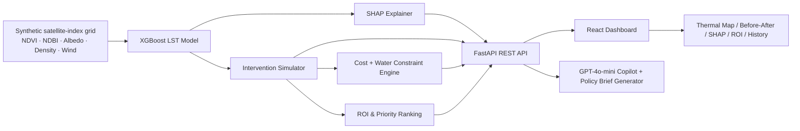

# 🌡️ ThermaGrid — AI-Powered Urban Heat Island Optimizer

**ThermaGrid turns satellite-style heat data into a budgeted, explainable action plan for cooling a city — block by block.**

Urban heat islands push city temperatures 3–7°C above surrounding areas, driving heatstroke deaths, spiking electricity demand, and hitting low-income neighborhoods hardest. City planners know heat is a problem — what they lack is a tool that says *exactly which block to fix, with which intervention, for how much money and water, and why it will work.*

ThermaGrid is that tool.

---

## What it does

1. **Maps the heat** — generates a high-resolution thermal grid (25×25 zones) per city from NDVI (vegetation), NDBI (built-up density), albedo (surface reflectance), building density, and wind speed — the same indices used in real Landsat/Sentinel satellite analysis.
2. **Explains the heat** — an XGBoost regression model predicts Land Surface Temperature (LST) per zone, with **SHAP attribution** showing exactly which factor (lack of trees? dark rooftops? density?) is driving the heat in that specific block — not a black box.
3. **Simulates interventions** — planners drag sliders for tree planting (+NDVI), cool/reflective roofs (+albedo), and de-paving (−NDBI) and instantly see the modelled temperature drop for a zone or the whole city, with a **before/after spatial heatmap**.
4. **Budgets it** — every simulation is costed in ₹/m² for greening, cool roofs, and permeable paving, checked against a user-set budget *and* a daily water allowance (because tree-planting plans that ignore water are not real plans).
5. **Ranks priorities** — a weighted scoring engine surfaces the top ROI zones (°C cooling per ₹1 lakh invested) and the most urgent hotspots, so limited budgets go where they help the most people.
6. **Tracks the trend** — a 10-year historical LST trend view per zone shows whether an area is warming, and how fast.
7. **Explains itself in English** — an AI Copilot (GPT-4o-mini, with a rule-based fallback so the app never breaks without an API key) answers planner questions in context, and can generate a formatted **executive policy brief** for city council.

## Why it's trustworthy, not just flashy

- Every simulated number carries a visible disclaimer: *"Modelled estimate based on ML scenario logic — not a guaranteed real-world reduction."*
- The model reports its own **R², RMSE, and uncertainty bounds** and lists its stated limitations (static microclimate assumptions, ~30m grid resolution, tree-maturation timelines) rather than hiding them.
- SHAP attribution makes the model's reasoning auditable per-zone instead of a black-box score.
- Candidate intervention sites are explicitly labeled *"Candidate area"* — a planning suggestion, not a survey-grade recommendation.

## Tech stack

| Layer | Tech |
|---|---|
| ML / Backend | Python, FastAPI, XGBoost, SHAP, scikit-learn, pandas/numpy |
| AI Copilot | OpenAI GPT-4o-mini (graceful rule-based fallback with no key) |
| Frontend | React 19 + Vite, Tailwind CSS |
| Mapping & Viz | React-Leaflet, Recharts, custom SVG heatmaps |

## Architecture



## Getting started

### Backend
```bash
cd backend
python -m venv .venv && source .venv/bin/activate   # optional but recommended
pip install -r requirements.txt
export OPENAI_API_KEY="sk-..."   # optional — app works without it via rule-based fallback
uvicorn main:app --reload --port 8000
```
API docs available at `http://localhost:8000/docs` once running.

### Frontend
```bash
cd frontend
npm install
npm run dev
```
Open the printed local URL (default `http://localhost:5173`). The frontend expects the backend at `http://localhost:8000/api`.

## Roadmap

- Swap synthetic grid generator for real Landsat 8/9 + Sentinel-3 pulls via Google Earth Engine
- Persist simulations per city/user so plans can be saved and compared over budget cycles
- Multi-zone batch optimization (allocate a fixed city-wide budget across all hotspots automatically)
- Municipal GIS export (shapefile / GeoJSON) for direct handoff to planning departments

## Disclaimer

Grid data in this build is **synthetically generated** using physics-informed equations calibrated to plausible real-world ranges, for demo purposes. It is not live satellite telemetry. Swapping in real Earth-observation data is the natural next step (see Roadmap).

---

Built for HACK26 - Hackathon

